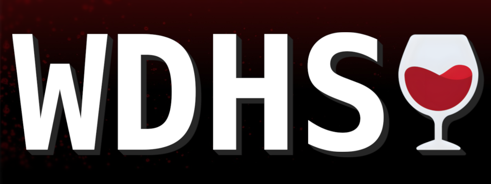
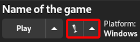
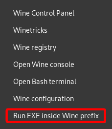

# Wine Dependency Hell Solver

## Introduction

If you ever had issues launching or running Windows games or applications under Wine, then try the script I made, it should solve most issues you may encounter.

## Description

This is a script that functions similarly to how Valve's installscript.vdf does. It installs Windows dependencies for games to work properly. However, not every game comes with all the required dependencies. So I decided to write a universal script to install **every single dependency** any game may require to work.

## Examples

Here are games that were fixed partially or completely after running this script:

- [Call of Juarez: Bound in Blood](https://github.com/ValveSoftware/Proton/issues/1831) - Issues with sound and video playback.
- [Darksiders](https://github.com/ValveSoftware/Proton/issues/264) - Missing main menu, in-game UI and cut-scenes.
- [Mortal Kombat Komplete Edition](https://github.com/ValveSoftware/Proton/issues/1185) - Broken character select screen.
- [Tell Me Why](https://github.com/ValveSoftware/Proton/issues/6829) - Cut-scenes crashes.
- [The Darkness II](https://github.com/ValveSoftware/Proton/issues/563) - Missing voice over.
- [Warhammer 40,000: Boltgun](https://github.com/ValveSoftware/Proton/issues/6795) - Broken cut-scenes.

## Packages

| Software                                                                                              | Fixes                                                    |
| ----------------------------------------------------------------------------------------------------- | -------------------------------------------------------- |
| [DirectX End-User Runtimes](https://www.microsoft.com/en-us/download/details.aspx?id=8109)            | Video and audio playback, missing or broken UI and menus |
| [ASP.NET Core Runtime](https://dotnet.microsoft.com/en-us/download)                                   | Crashing installers                                      |
| [Media Foundation](https://github.com/z0z0z/mf-installcab)                                            | Some cases of video playback                             |
| [NVIDIA PhysX](https://www.nvidia.com/en-us/drivers/physx/9_09_0428/physx_9-09-0428_whql/)            | Games crashing when relying heavily on the technology    |
| [Visual C++ Redistributable packages](https://www.microsoft.com/en-us/download/details.aspx?id=30679) | Various crashes and missing .dll issues                  |

**Disclaimer**: Though my script installs Media Foundation you may still exhibit unwanted behavior.

**All installers are taken directly from official sources.**

## Instructions

Make sure to have the following packages installed before proceeding: `7z curl`

1. Run `bash <(curl -sSL https://raw.githubusercontent.com/FanderWasTaken/wine-dependency-hell-solver/main/WDHS.sh)` in your terminal.
2. Start `WDHS.bat` with [Protontricks](https://github.com/Matoking/protontricks) by double clicking it or via Lutris.

    
 Lutris instructions

      

## Additional fixes and improvements

Wayland helps to alleviate most issues related to screen-tearing, frame pacing and input latency. If you're experiencing screen-tearing on X11, please follow [this guide](https://linuxreviews.org/HOWTO_fix_screen_tearing).

 Debian, Ubuntu and their derivatives

On Debian and Ubuntu base distros you need to install drivers.

- For AMD use this command: `sudo dpkg --add-architecture i386 && sudo apt update && sudo apt upgrade && sudo apt install libgl1-mesa-dri:i386 mesa-vulkan-drivers mesa-vulkan-drivers:i386`

- For NVIDIA your distro should offer you a way to download a driver upon first boot or have them pre-installed. Run this command to add packages that may not have been installed automatically: `sudo dpkg --add-architecture i386 && sudo apt update && sudo apt install -y libvulkan1 libvulkan1:i386`

**I highly discourage you from using PPAs for Mesa or NVIDIA Drivers** as they can potentially brick your system. And if you do update in that way, please use `ppa-purge` in order to remove these packages if any issues do arise.

 Shader cache and DXVK related stuttering

In order to minimize stuttering with Bottles or Lutris use [dxvk-gplasync](https://gitlab.com/Ph42oN/dxvk-gplasync). Run the following command to insure it works correctly: `echo 'dxvk.enableAsync=true'>~/.config/dxvk.conf; echo 'dxvk.gplAsyncCache=true'>>~/.config/dxvk.conf`. For Lutris you can install it into `~/.local/share/lutris/runtime/dxvk`. Also make sure to disable `DXVK-NVAPI DLSS` for the Wine runner in Lutris as it can cause games to crash on AMD GPUs.

## Credits

- [installscript.vdf | Valve](https://partner.steamgames.com/doc/sdk/installscripts)
- [Troubleshooting Guide | PCGamingWiki](https://www.pcgamingwiki.com/wiki/Troubleshooting_guide)
- Project was created with the help of [Visual Studio Code](https://code.visualstudio.com/)

---

Feel free to donate if you like my work or if I was of any help to you!
