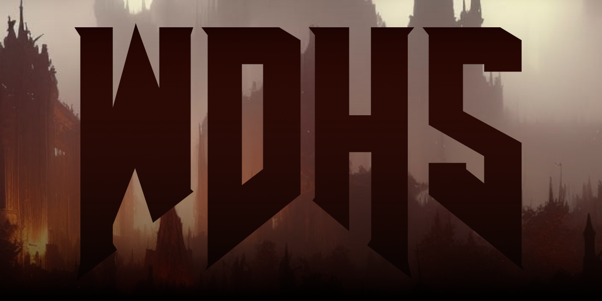

# Wine Dependency Hell Solver

Ever had issues launching or running Windows games under Wine? If the answer is *"Yes"*, then try these scripts I made; they should solve most issues you may encounter. And in case my script did make your gaming experience worse, then feel free to create an issue here on GitHub so I can help you out.

## What is this exactly?
This is a collection of scripts that function similarly to how Valve's installscript.vdf does. The said .vdf file installs Windows dependencies upon first launch for games to work properly. However, this is not always the case. Not all Steam games come with all the required dependencies installed. Also, non-Steam and older games don't always come with these either. So I decided to write a *universal* script to install **every single dependency** any game may require to work. This usually fixes startup problems, issues related to videos not playing, missing audio, and broken UI or menus. These scripts should work with any Wine version and prefix manager, including Steam.

## What's being installed:
- DirectX End-User Runtimes
- ASP.NET Core Runtime
- Media Foundation
- NVIDIA PhysX
- Visual C++ Redistributable packages

**Disclaimer**: Though my script installs Media Foundation dependencies you may still exhibit unwanted behavior.

**All installers are taken directly from official sources.**

## How to use:

Make sure that you have `curl` and `7z` installed on your system before proceeding.

1. Download and extract the latest release.
2. Open your terminal in the extracted folder.
3. Make `.sh` executable by running `chmod +x ./installers/Download_installers.sh`.
4. Run `./installers/Download_installers.sh` in your terminal. This will download  all the required installation files.
5. Run `WDHS.bat` with wine or proton inside the game's prefix; the script outputs install progress into the terminal, so it will inform you when it's done.

Steps 1-4 are only for people running this for the first time. You can keep downloaded installers and `WDHS.bat` somewhere in your home directory to re-use later if needed.

## Additional tips

If you are using Lutris, go into `Preferences`, `Global Options` for **Wine runner** and make sure to have `Disable Lutris Runtime` and `Prefer system libraries` enabled (switched on).

Also, I personally recommend you install `gamescope` package from your distribution and use it with games. Gamescope can fix screen-tearing and lower overall input latency during gameplay. It can be enabled via Lutris' `Preferences`, `System Options` menus. For Steam games, add `gamescope -f -e -h [your screen resolution, e.g. 1080] -r [optional framerate cap, e.g. 60] -- %command%` as a launch option.

## Troubleshooting
Before opening an issue, make sure to try different Wine or Proton versions with your game. The recommended path is to go from the newest release down to the oldest. Personally, I found that Proton 7 had fewer compatibility issues than Proton 8. The easiest way to install **custom** Wine builds is with [ProtonUp-Qt](https://davidotek.github.io/protonup-qt/).

## Credits
- [Troubleshooting Guide | PCGamingWiki](https://www.pcgamingwiki.com/wiki/Troubleshooting_guide)
- [installscript.vdf | Valve](https://partner.steamgames.com/doc/sdk/installscripts)
- [ProtonUp-Qt | DavidoTek](https://github.com/DavidoTek/ProtonUp-Qt)
- [DirectX End-User Runtimes (June 2010) | Microsoft](https://www.microsoft.com/en-us/download/details.aspx?id=8109)
- [.NET | Microsoft](https://dotnet.microsoft.com/en-us/download)
- [Media Foundation workaround for Wine | z0z0z](https://github.com/z0z0z/mf-install)
- [Installcab based Media Foundation workaround for Wine | z0z0z](https://github.com/z0z0z/mf-installcab)
- [PhysX System Software | NVIDIA](https://www.nvidia.com/en-us/drivers/physx/9_09_0428/physx_9-09-0428_whql/)
- [ Visual C++ Redistributable for Visual Studio 2012 Update 4  | Microsoft](https://www.microsoft.com/en-us/download/details.aspx?id=30679)
- [Wine | Wine authors](https://www.winehq.org/)
- [Proton | Valve](https://github.com/ValveSoftware/Proton)
- [Proton-GE | GloriousEggroll](https://github.com/GloriousEggroll/proton-ge-custom)
- [Wine-GE | GloriousEggroll](https://github.com/GloriousEggroll/wine-ge-custom)
- [Lutris | Community, Mathieu Comandon](https://lutris.net/)
- [Gamescope | ArchWiki](https://wiki.archlinux.org/title/Gamescope)
---
### 
This project was created with the help of [VSCodium](https://vscodium.com/). Thank you guys 💙

